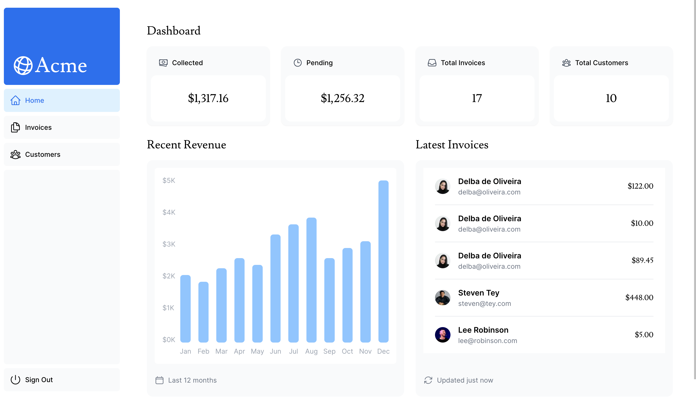
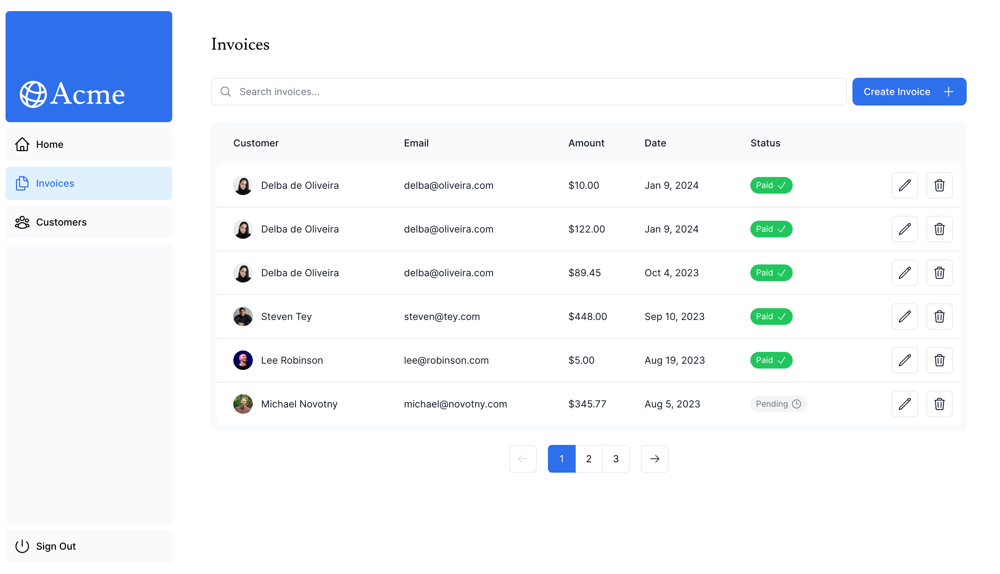
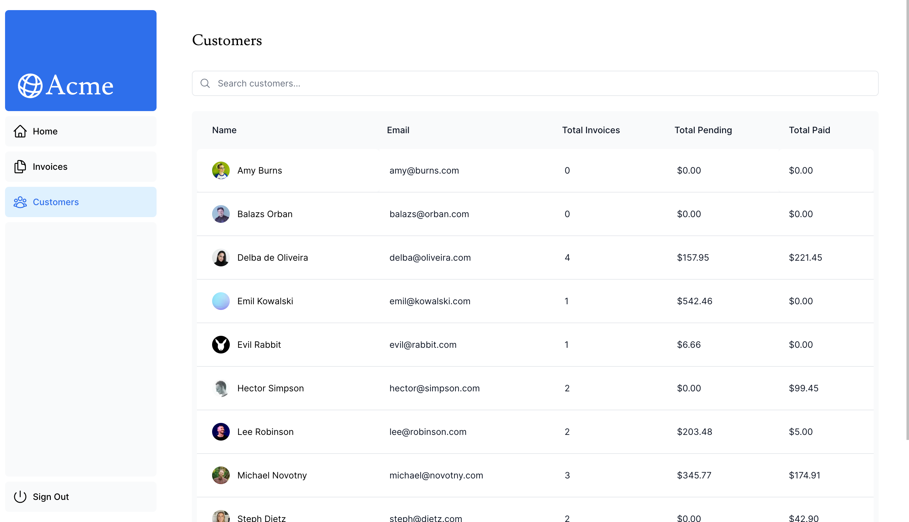

## Next.js Invoice Tracker

This project was built following the [Next.js App Router Course](https://nextjs.org/learn/dashboard-app).

## Purpose

To learn the main features of the Next.js framework by building a full-stack web application.

## Features
- Dashboard pages that are protected by authentication.
- The ability for users to add, edit, and delete invoices.
- Search and Pagination on Invoice dashboard.
- Improved initial loading performance by implementing streaming.

## Final Product

View live demo [here](https://nextjs-dashboard-five-jade-76.vercel.app/dashboard)!

**Dashboard Page**

**Invoices Page**

**Customers Page**

